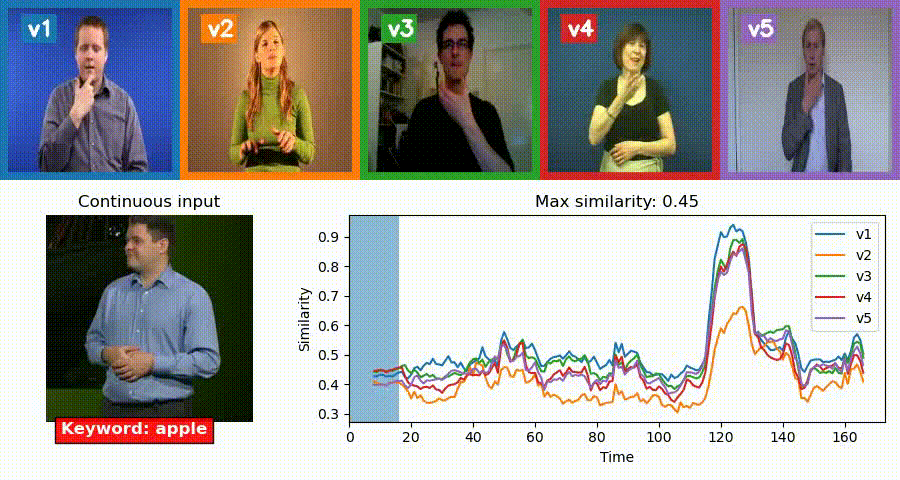

# Watch, read and lookup: learning to spot signs from multiple supervisors

[Liliane Momeni*](https://www.robots.ox.ac.uk/~liliane/), [Gül Varol*](https://www.robots.ox.ac.uk/~gul), [Samuel Albanie*](https://www.robots.ox.ac.uk/~albanie/), [Triantafyllos Afouras](https://www.robots.ox.ac.uk/~afourast/) and [Andrew Zisserman](https://www.robots.ox.ac.uk/~az/),
*Watch, read and lookup: learning to spot signs from multiple supervisors*, ACCV 2020. **Songde Ma Best Application Paper Award**

[[Project page]](https://www.robots.ox.ac.uk/~vgg/research/bsldict/) [[arXiv](https://arxiv.org/abs/2010.04002)]



Given the *continuous* sign language video (**bottom row, left**), our goal is to determine *whether* and *where* the user-defined sign (e.g., “apple”) occurs
by using example videos of the *isolated* sign from a dictionary (**top row**, showing the middle frame of each dictionary video).
There can be several video examples for a single word in the dictionary (e.g., v1-v5)
and these can represent multiple signs for [several reasons](https://www.signbsl.com/about): (i) a word can have more than one meaning, resulting in
a different sign per meaning, (ii) there can be regional variations on how a sign is presented, corresponding to different sign *variants*.
We plot the similarity scores between the continuous input and each of the dictionary examples over time (**bottom row, right**).

## Contents
* [Setup](#setup)
* [BSLDict Dataset](#bsldict-dataset)
* [Pretrained Models](#pretrained-models)
* [Demo](#demo)
* [Limitations](#limitations)
* [Citation](#citation)
* [License](#license)
* [Acknowledgements](#acknowledgements)

TODO:
- [ ] Release pose keypoints
- [ ] Re-extract features to include the missing 88 short videos.

## Setup

``` bash
# Clone this repository
git clone https://github.com/gulvarol/bsldict.git
cd bsldict/
# Create bsldict_env environment
# (Alternatively you can manually setup by running lines in `environment_setup.sh`)
conda env create -f environment.yml
conda activate bsldict_env
# Download BSLDict dataset metadata (148MB)
(cd bsldict; bash download_bsldict_metadata.sh)
# Download pretrained models (118MB)
(cd models; bash download_models.sh)
```

## BSLDict Dataset
BSLDict dictionary videos are collected from a BSL sign aggregation platform [signbsl.com](https://www.signbsl.com/), giving a total of 14K video clips for a vocabulary of 9K words and phrases. Each sign is typically performed several times by different signers, sometimes in different ways.
The dictionary videos are of *isolated* signs, meaning:
* the start and end of the video clips usually consist of a still signer pausing,
* the sign is performed at a much slower rate for clarity.

<p align="center">

</p>

To download the BSLDict metadata (148MB), run `(cd bsldict; bash download_bsldict_metadata.sh)`.
Please refer to the [BSLDict documentation](bsldict/README.md) for the contents of the downloaded `bsldict_v1.pkl` file.

To download the videos, run `python download_videos.py` which will create a folder `bsldict/videos_original` and will use
a combination of `wget` and `youtube-dl` to download `.mp4` videos.

In our experiments, we trim the sign dictionary videos, using body keypoints estimated with [pytorch-openpose](https://github.com/Hzzone/pytorch-openpose) which indicate the start and end of wrist motion, to discard frames where the signer is still.

## Pretrained Models
You can download our pretrained models used in the experiments by running `(cd models; bash download_models.sh)`.
* `i3d.pth.tar (52MB)` I3D trunk weights are trained for sign classification.
* `mlp.pth.tar (8MB)` MLP model weights are trained with *Watch, Read and Lookup* framework - both models are trained jointly on [BSL-1K](https://www.robots.ox.ac.uk/~vgg/research/bsl1k/) and [BSLDict](#bsldict-dataset) datasets.
* We also provide a combined model `i3d_mlp.pth.tar (59MB)` for convenience, which is used in the demo.

## Demo
The demo folder contains a sample script to spot a user-defined sign in a *continuous* sign language video sequence, given an example of the *isolated* sign from a sign dictionary. 

```
usage: demo.py [-h] [--checkpoint_path CHECKPOINT_PATH] [--bsldict_metadata_path BSLDICT_METADATA_PATH] [--keyword KEYWORD]
               [--input_path INPUT_PATH] [--viz VIZ] [--output_path OUTPUT_PATH] [--viz_with_dict VIZ_WITH_DICT] [--gen_gif GEN_GIF]
               [--similarity_thres SIMILARITY_THRES] [--batch_size BATCH_SIZE] [--stride STRIDE] [--num_in_frames NUM_IN_FRAMES] [--fps FPS]
               [--embd_dim EMBD_DIM]
```

Example usage:
``` bash
cd demo
# Print arguments
python demo.py -h
# Spot signs "apple", "garden", "tree" in the sample video input sample_data/input.mp4
python demo.py --input_path sample_data/input.mp4 --keyword apple --output_path sample_data/output_apple.mp4
python demo.py --input_path sample_data/input.mp4 --keyword garden --output_path sample_data/output_garden.mp4
python demo.py --input_path sample_data/input.mp4 --keyword tree --output_path sample_data/output_tree.mp4
```

The demo will: 
1. use the `models/i3d_mlp.pth.tar` pretrained model,
3. use the pre-computed MLP features for the BSLDict dataset included in `bsldict/bsldict_v1.pkl`,
3. input the sample continuous sign language video `demo/sample_data/input.mp4`,
4. run the sign spotting for a user-defined sign, by default "apple", and output the visualization as [above](#watch-read-and-lookup-learning-to-spot-signs-from-multiple-supervisors).

## Limitations
We would like to emphasise that this research represents a work in progress towards achieving automatic spotting of signs in continuous sign language using isolated sign dictionaries, and as such, has a number of limitations that we are aware of (and likely many that we are not aware of). Key limitations include:

* Our continuous sign language data is interpreted. Interpreted data differs from conversations between native signers (e.g. while interpreting, the vocabulary and style of signing can often be simplified and the speed of signing may also vary - please refer to the [paper](https://arxiv.org/abs/1908.08597) by Bragg et al. for more details).

* Our models have been trained on [BSL-1K](https://www.robots.ox.ac.uk/~vgg/research/bsl1k/) and BSLDict jointly. This might not generalise to videos from very different domains.

* Our models may be limited by the bias inherent in the training data. For those seeking to use the BSLDict dataset or the pretrained models for commercial purposes, it is strongly advised to take the necessary steps to ensure responsible design and development, avoiding discrimination and unintentional bias and unequal treatment of users. 

## Citation
If you use this code and data, please cite the following:

```
@INPROCEEDINGS{momeni20_bsldict,
  title     = {Watch, read and lookup: learning to spot signs from multiple supervisors},
  author    = {Momeni, Liliane and Varol, G{\"u}l and Albanie, Samuel and Afouras, Triantafyllos and Zisserman, Andrew},
  booktitle = {ACCV},
  year      = {2020}
}
```

## License
Please check the [license](https://www.robots.ox.ac.uk/~vgg/research/bsldict/index.html#data) before downloading or using the BSLDict dataset.

## Acknowledgements

This work was supported by EPSRC grant ExTol. The authors are also grateful to Daniel Mitchell who made [signbsl.com](https://www.signbsl.com/) webpage available.
